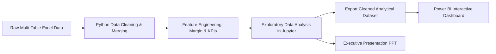
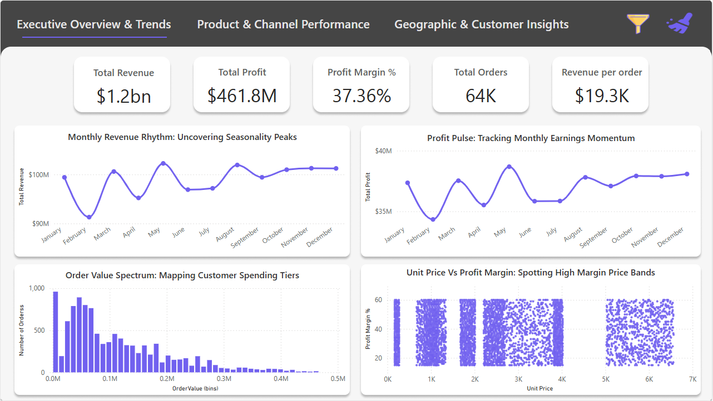
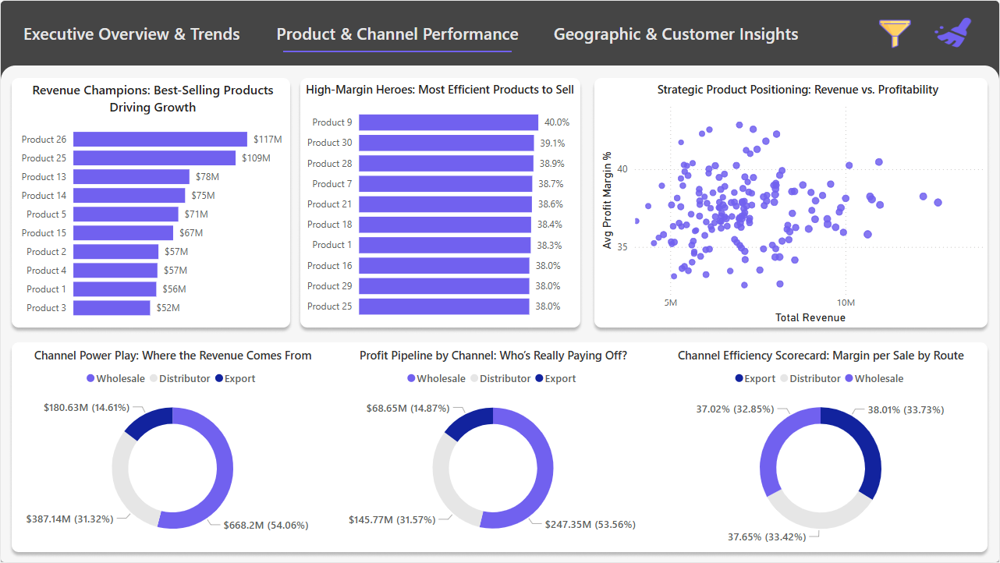
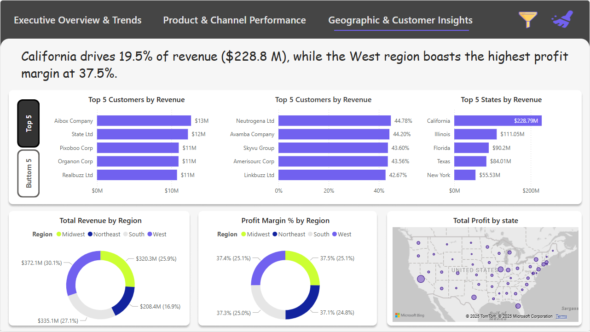
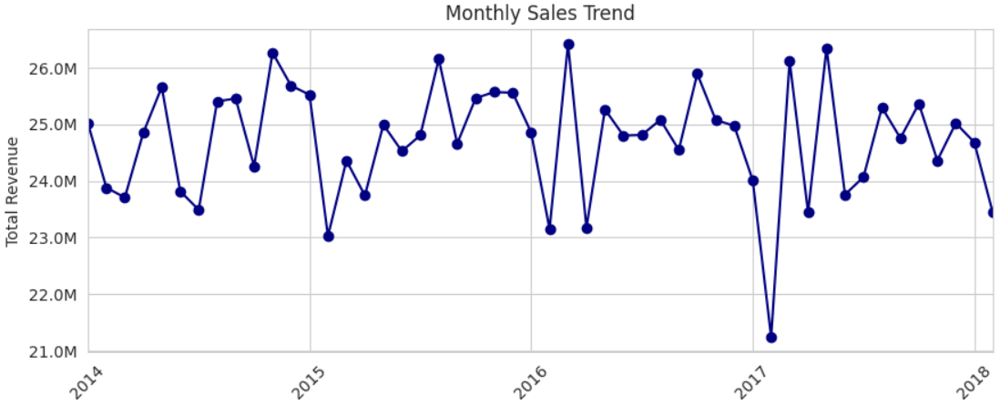
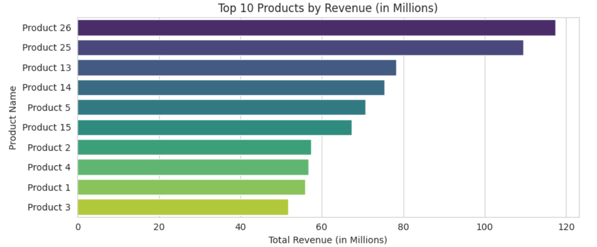
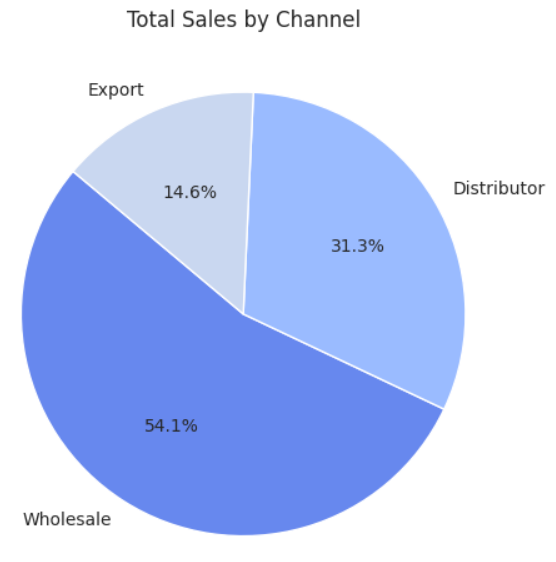
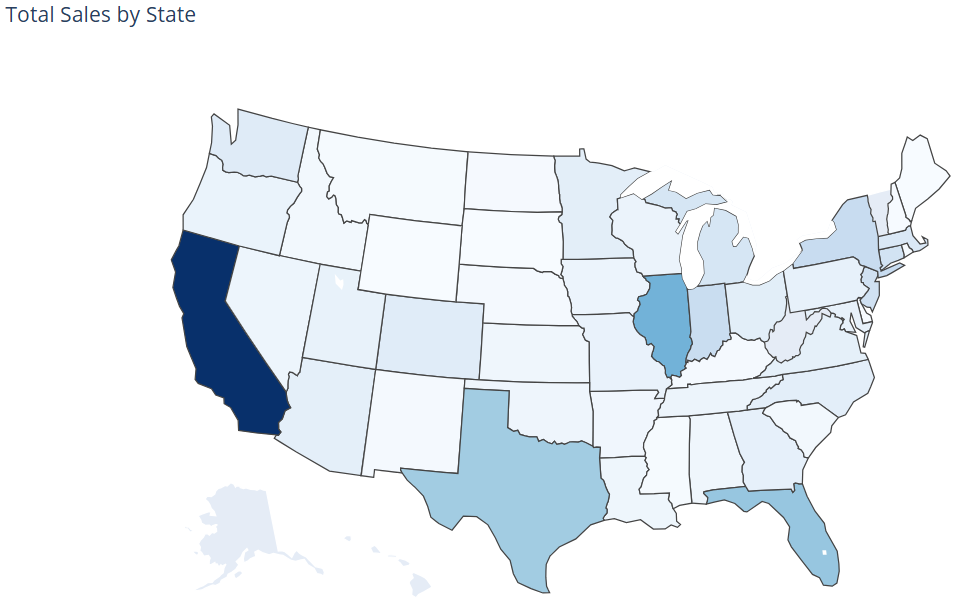
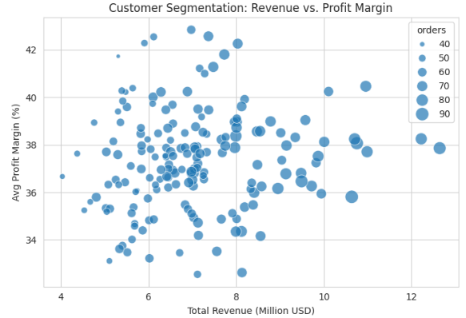
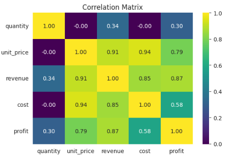

<p align="center">
  
</p>

<h1 align="center">📊 USA Regional Sales & Revenue Analytics</h1>

<p align="center">
  <strong>An End-to-End Business Intelligence & Exploratory Data Analysis Project</strong><br>
  <em>Transforming unorganized transaction data into actionable executive insights, interactive Power BI dashboards, and strategic growth drivers.</em>
</p>

<p align="center">
  
  
  
  
  
  
</p>

---

## 📑 Table of Contents
- [Project Overview](#-project-overview)
- [Problem Statement & Objectives](#-problem-statement--objectives)
- [End-to-End Project Workflow](#-end-to-end-project-workflow)
- [Interactive Power BI Dashboards](#-interactive-power-bi-dashboards)
- [Exploratory Data Analysis (EDA) Highlights](#-exploratory-data-analysis-eda-highlights)
- [Key Insights & Business Findings](#-key-insights--business-findings)
- [Strategic Business Recommendations](#-strategic-business-recommendations)
- [Repository Structure](#-repository-structure)
- [Getting Started & Reproduction](#-getting-started--reproduction)
- [Author](#-author)

---

## 📌 Project Overview

This project delivers a comprehensive, multi-phase analytical solution designed to investigate regional sales performance, product profitability, channel distribution, and customer purchase behaviors across the United States. 

The analysis progresses through the complete **Data Analytics Lifecycle**:
1. **Data Ingestion & Cleaning:** Merging disparate datasets (Sales, Customers, Products, Regions, State-Region mapping, and Budgets).
2. **Feature Engineering:** Creating key financial metrics including `profit`, `profit_margin_pct`, and calendar attributes.
3. **In-Depth Python EDA:** 15 focused analytical modules investigating trends, correlations, geospatial patterns, and SKU concentration.
4. **Interactive Power BI Reporting:** Multi-page dashboard for executive self-service analytics and scenario planning.
5. **Executive Presentation Deck:** Boardroom-ready slide presentation summarizing strategic takeaways for stakeholders.

---

## 🎯 Problem Statement & Objectives

### ❓ Problem Statement
The business faced unlinked transaction tables, fragmented customer records, and inconsistent revenue and profit margins across regional territories. Leadership lacked centralized visibility into:
- Underperforming geographic markets and seasonal revenue dips.
- SKU-level profitability and discounting leakages among top-tier clients.
- Channel-specific margin contributions (Wholesale vs. Distributor vs. Export).

### 🎯 Key Objectives
- **Centralize & Cleanse:** Consolidate raw multi-sheet Excel data into a normalized, single-source analytical data warehouse.
- **Surface Profit Drivers:** Identify top revenue-generating products vs. high-margin products to guide inventory and pricing strategies.
- **Customer Segmentation:** Classify customer accounts by revenue volume and margin health to mitigate account churn and excessive discounting.
- **Actionable Self-Service BI:** Empower executive decision-makers with interactive filters across time, territory, channel, and customer tiers.

---

## 🔄 End-to-End Project Workflow



---

## 📊 Interactive Power BI Dashboards

The Power BI report (`SALES REPORT.pbix`) is designed across three dedicated analytical pages for executive decision-makers:

### 1. Executive Performance Summary
*High-level view of Total Revenue, Total Profit, Gross Margin %, Regional Sales Distribution, and Channel Performance.*
<p align="center">
  
</p>

### 2. Customer Segmentation & Profitability Analysis
*In-depth segmentation of enterprise accounts, identifying high-margin growth targets and discounting hotspots.*
<p align="center">
  
</p>

### 3. Revenue Scenarios & Forward Projections
*Dynamic forecasting and what-if sensitivity analysis across territories and product lines.*
<p align="center">
  
</p>

---

## 🔍 Exploratory Data Analysis (EDA) Highlights

Below are key visual insights uncovered during Python exploratory analysis (`EDA_Regional_Sales_Analysis.ipynb`):

| Analysis Module | Visual Preview | Strategic Takeaway |
| :--- | :---: | :--- |
| **Monthly Sales Trend Over Time** |  | Predictable revenue baseline ($24M–$26M) with peak performance in late spring/early summer and recurring seasonal dips in April/January. |
| **Top Products by Revenue** |  | **Products 26 & 25** dominate total revenue, generating over 25% of aggregate sales volume. |
| **Sales Distribution by Channel** |  | **Wholesale** drives 54.1% of volume, while **Export** yields the highest average gross margins (~38%). |
| **State-Level Revenue (Choropleth)** |  | **California** dominates with $230M+ across 7.6K orders. Texas, Florida, and Illinois represent strong secondary hubs. |
| **Customer Segmentation (Rev vs. Margin)** |  | Disproportionate revenue concentration in enterprise accounts (`Aibox Company`, `State Ltd`), highlighting margin stabilization opportunities. |
| **Feature Correlation Matrix** |  | Unit price is the primary financial driver (corr: 0.91 with Revenue, 0.79 with Profit), confirming pricing power over pure volume. |

---

## 💡 Key Insights & Business Findings

1. **Pronounced Seasonality:** Revenue peaks during May–June ($124M+) and hits annual lows in April ($95M), requiring proactive inventory staging and seasonal promotional campaigns.
2. **SKU Pareto Concentration:** A small subset of products (Products 26, 25, 18, 28) generate the bulk of enterprise margin and revenue.
3. **Channel Trade-Offs:** Wholesale captures volume (54%), but Export provides significantly stronger gross margin percentages (38%+).
4. **Geographic Clustering:** West & South regions drive >60% of total revenue. Midwest and Northeast present untapped expansion opportunities.
5. **Pricing Sensitivity:** Unit price correlates at 0.91 with revenue and 0.79 with profit, indicating margin uplift must prioritize pricing discipline over aggressive volume discounting.

---

## 🚀 Strategic Business Recommendations

- **🎯 Seasonal Promotional Alignment:** Launch targeted marketing campaigns in Q1/April to mitigate annual seasonal troughs and stabilize cash flow.
- **📦 SKU Portfolio Optimization:** Allocate prime marketing budget and inventory capacity to core revenue drivers (SKUs 25 & 26), while re-evaluating or bundling low-margin tail products.
- **🌐 Channel Incentivization:** Introduce tiered volume discounts for Wholesale distributors while aggressively scaling high-margin Export partnerships.
- **📍 Territory Playbook Replication:** Benchmark California's high-conversion sales playbook and replicate operations in mid-tier states across the Midwest and Northeast.
- **🛡️ High-Value Margin Safeguards:** Implement strict discount approvals for enterprise clients exceeding $10M in revenue where margins fall below 36%.

---

## 📂 Repository Structure

```plaintext
my-sales-project/
│
├── assets/                                      # Project visual assets & dashboard screenshots
│   ├── header_banner.jpg                       # Top header presentation graphic
│   ├── footer_banner.jpg                       # Bottom terminal graphic
│   ├── dashboard_performance_summary.png       # Power BI Page 1 preview
│   ├── dashboard_customer_segmentation.png     # Power BI Page 2 preview
│   ├── dashboard_revenue_scenarios.png         # Power BI Page 3 preview
│   ├── eda_monthly_sales_trend.png             # Trend analysis visual
│   ├── eda_top_products_revenue.png            # Product revenue ranking visual
│   ├── eda_sales_by_channel.png                # Channel distribution visual
│   ├── eda_state_sales_map.png                 # Geospatial choropleth map
│   ├── eda_customer_segmentation.png           # Customer scatter matrix
│   └── eda_correlation_heatmap.png             # Statistical correlation heatmap
│
├── EDA_Regional_Sales_Analysis.ipynb           # Complete Jupyter Notebook (Python EDA & Wrangling)
├── SALES REPORT.pbix                           # Interactive Power BI Report File
├── PPT --- Regional Sales Analysis.pptx        # Executive Slide Deck for Stakeholders
├── Regional Sales Dataset.xlsx                 # Raw multi-table Excel transaction dataset
├── Sales_data(EDA Exported).csv                # Pre-processed clean dataset for BI modeling
└── README.md                                   # Comprehensive Project Documentation
```

---

## ⚙️ Getting Started & Reproduction

### 1. Clone the Repository
```bash
git clone https://github.com/Ishant6565/my-sales-project.git
cd my-sales-project
```

### 2. Set Up Python Environment & Run EDA
```bash
# Create virtual environment
python -m venv venv

# Activate virtual environment (Windows)
.\venv\Scripts\activate

# Install required analytics packages
pip install pandas numpy matplotlib seaborn jupyter openpyxl

# Launch Jupyter Notebook
jupyter notebook EDA_Regional_Sales_Analysis.ipynb
```

### 3. Open Power BI Dashboard
1. Download and install [Power BI Desktop](https://powerbi.microsoft.com/desktop/).
2. Open `SALES REPORT.pbix` directly to explore interactive cross-filtering, drill-throughs, and KPI cards.

---

## 👤 Author

**Ishant Gupta**
- **GitHub:** [@Ishant6565](https://github.com/Ishant6565)
- **Repository:** [my-sales-project](https://github.com/Ishant6565/my-sales-project)

---

<p align="center">
  
</p>
